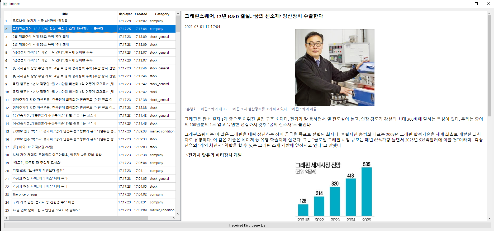
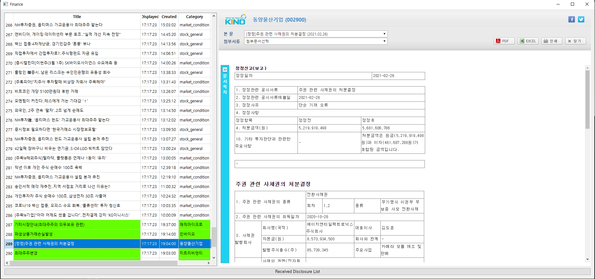

# news_disclosure_crawler

## 프로그램 개요
```python
python run_crawler.py
```



[다음뉴스](https://finance.daum.net/news), [KIND](https://kind.krx.co.kr/disclosure/todaydisclosure.do?method=searchTodayDisclosureMain&marketType=1), [DART](http://dart.fss.or.kr/dsac001/mainAll.do) 사이트를 크롤링하여 실시간 뉴스와 공시정보를 확인할 수 있는 프로그램입니다.

## 특징

* 크롤링된 정보는 *sqlite*를 이용하여 Database에 저장됩니다.
* 저장된 DB와 새롭게 크롤링한 정보를 비교하여 업데이트합니다.
* DB에 저장되는 최대개수를 설정할 수 있습니다.
* 테이블에 입력된 공시/뉴스를 클릭할 경우 우측에 있는 QWebEngineView로 공시내용을 확인할 수 있습니다.
* 테이블은 지정된 개수까지 저장되며 제한개수를 넘는 경우 오래된 뉴스/공시부터 삭제됩니다.
* 크롤링 횟수는 기본 분당 20개이며 설정을 통해 바꿀 수 있습니다.

## Requiremets
* `BeautifulSoup`
* `PyQt5`
* `requests`
